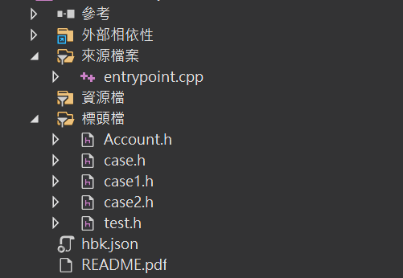
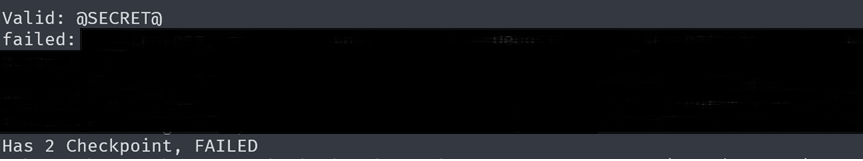
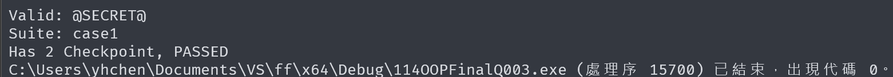
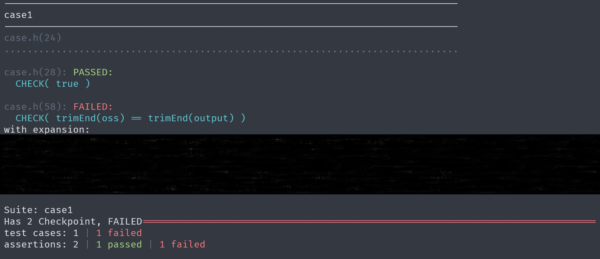

# How To Use

|  |
| :-----------------------: |
|         檔案一覽          |

題目下載後的資料夾，會包含幾個檔案：

1. `entrypoint.cpp`
2. `case.h` 與 `case*.h`
3. `test.h`

在一開始時，直接針對專案進行編譯預期是「**無法編譯**」的，請參考 `case.h` 中的描述：

```cpp
#ifndef _CASE_H_
#define _CASE_H_

/**
 * @brief Replace case.h
 * The question setter provided case*.h
 */

#endif
```

將 `case*.h` (通常是 `case1.h` 與 `case2.h`) 替換掉 `case.h` 的內容，然後重新編譯：

然後嘗試撰寫代碼，將題目預期的實作完成後，進行編譯：

|  |  |
| :-------------------: | :---------------------: |
|       作答失敗        |        作答成功         |

- 若該題作答失敗，最後會顯示「`FAILED`」，並嘗試顯示錯誤內容。
- 若該題作答成功，最後會顯示「`PASSED`」。

在 `entrypoint.cpp` 中，有幾個代碼可以進行調整：

```cpp
#define CATCH_CONFIG_RUNNER
#define CATCH_CONFIG_DELIM "\t" // -------------     1
#define ONLINE_JUDGE
#include "case.h"

int main(int argc, char* argv[]) {
  Catch::Session session;

  auto& config = session.configData();
  config.showSuccessfulTests = false; // ----------- 2
  config.reporterName = "compact";    // ----------- 3
  config.abortAfter = -1;
  config.useColour = Catch::UseColour::No; // ------ 4

  auto failedCount = session.run(argc, argv);

  return failedCount;
}
```

1. `CATCH_CONFIG_DELIM` 當測資未通過時，多個測資之間如何拚接，建議使用
2. `config.showSuccessfulTests` 是否顯示通過的測資
3. `config.reporterName` 允許使用 `compact` | `console` | `junit` | `xml`，建議使用 `console` 或 `compact` 即可
4. `config.useColour` 輸出是否上色，`Catch::UseColour::No` 或是 `Catch::UseColour::Yes`

|  |
| :-----------------------: |
|      console + 上色       |

