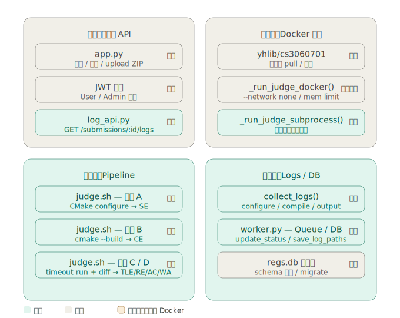

# REGS — Online Judge System

一個採用 **TDD / BDD（測試/行為驅動開發）** 打造的 Online Judge 系統。

目前已完成核心評測 Pipeline（編譯 → 執行 → 判題 → Log/DB 記錄），支援在本機環境完整運行。

---

## 📌 系統核心流程

整體自動化評測流程如下：


$$\text{學生上傳程式} \longrightarrow \text{自動編譯} \longrightarrow \text{安全執行} \longrightarrow \text{自動判題} \longrightarrow \text{回傳結果}$$

### ⚖️ 判題狀態對照表

| 狀態碼 | 完整名稱 | 說明 |
| --- | --- | --- |
| **AC** | Accepted | 答案正確 |
| **WA** | Wrong Answer | 答案錯誤 |
| **CE** | Compile Error | 編譯錯誤 |
| **RE** | Runtime Error | 執行錯誤 |
| **TLE** | Time Limit Exceeded | 執行超時 |
| **SE** | System Error | 系統錯誤（如 CMake 設定或環境配置失敗） |

---

## 🧱 系統架構



### ⚙️ 模組詳細說明

### ① API Layer（使用者入口）

* **核心檔案**：`app.py` / `log_api.py`
* **目前進度**：
* ✅ 查詢 Submission Logs（已完成）
* ⏳ JWT 登入驗證（待完善）
* ⏳ 提交 ZIP 壓縮檔功能（待實作）


### ② Execution Sandbox（安全執行環境）

* **核心檔案**：`worker.py` / `subprocess` / `Docker`
* **目前進度**：
* ✅ `_run_judge_subprocess()`（本機測試用，功能完整）
* ⚠️ `_run_judge_docker()`（骨架已建構，細節優化中）
* ⏳ Docker Isolation（`--network none` 網路隔離安全設定待接入）


### ③ Judge Pipeline（核心評測核心）

* **核心檔案**：`judge/judge.sh`
* **評測階段（Stages）**：
* **Stage A**：CMake configure $\rightarrow$ 失敗則觸發 **SE**
* **Stage B**：Build / Compile $\rightarrow$ 失敗則觸發 **CE**
* **Stage C**：Run Program $\rightarrow$ 異常則觸發 **TLE / RE**
* **Stage D**：Judge Output $\rightarrow$ 比對產出 **AC / WA**


* **目前進度**：✅ 已全部完成並通過整合測試

### ④ Logs & Database（資料與日誌）

* **核心檔案**：`worker.py` / SQLite / `collect_logs()`
* **日誌記錄範疇**：
* `configure.log`（CMake 配置記錄）
* `compile.log`（編譯錯誤訊息）
* `output.log`（程式執行輸出）


* **資料庫實體（Tables）**：
* `users` / `problems` / `submissions` / `submission_logs`


* **目前進度**：
* ✅ Log 與 DB 基本功能皆已完成
* ⚠️ Database Migration 系統待補全


---

## 🧪 測試狀態 (Testing Status)

系統堅持測試先行，目前測試覆蓋率完整。你可以透過以下指令運行測試：

```bash
pytest tests/ -v

```

> **測試成果回報：**
> * ✅ **62 tests passed**（全數通過）
> * ✅ **Pipeline 全覆蓋**（核心評測邏輯皆有對應測試）
> * ✅ **Logs / DB 測試完成**（確保資料寫入與日誌保存正確性）
> * ✅ **BDD Scenario 完整**（符合業務行為情境描述）
> 
> 

---

## 🚧 待辦事項與未來展望 (Todo List)

### 🔴 必要功能（高優先權）

* [ ] **Docker 完整 Sandbox**：實現真正的安全隔離執行環境。
* [ ] **Submission Upload API**：完善 `app.py` 的檔案上傳端點。
* [ ] **DB Migration System**：建立資料庫遷移機制（如使用 Alembic）。
* [ ] **RBAC 權限控管**：區分學生、助教與管理員權限。